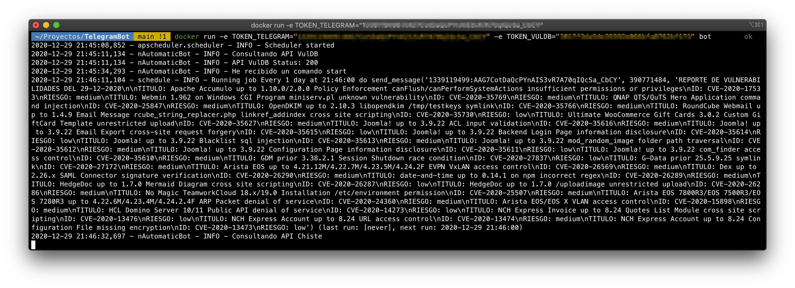
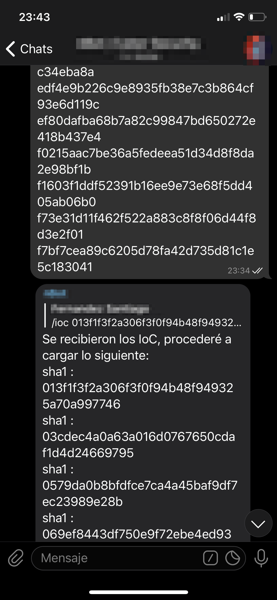
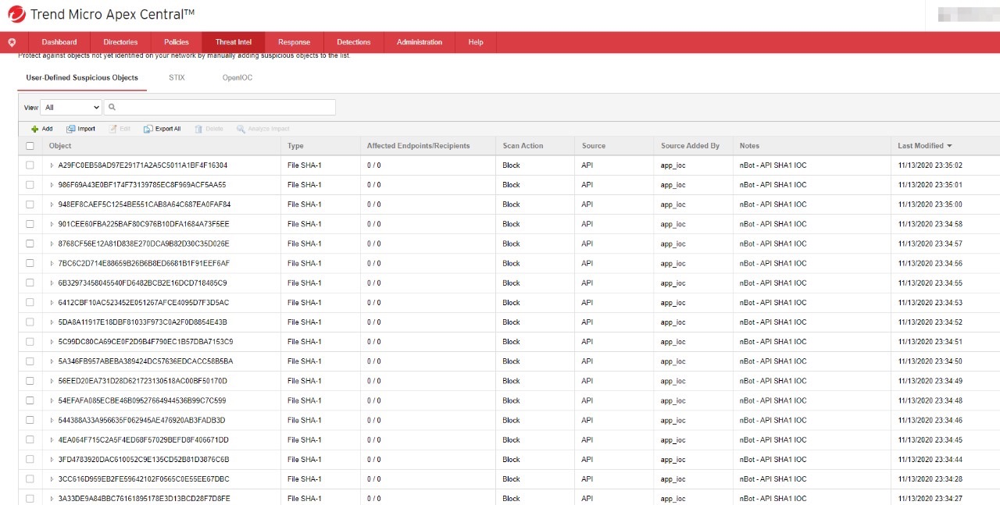
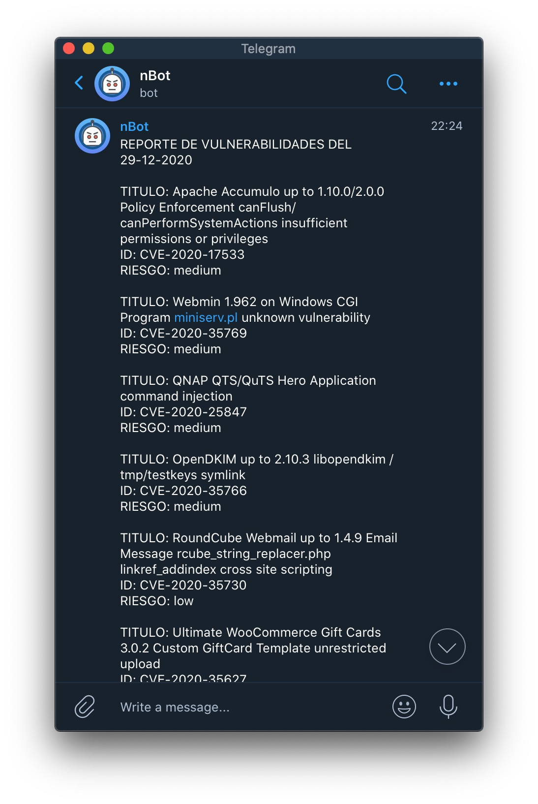

# Telegram IoC Bot

Add your IoC to your Antivirus Console & Firewall by a message.

### Create your bot with BotFather & generate your Token

[How To](https://core.telegram.org/bots)
<p align="center">

</p>

### Steps

#### Download the Proyect

```bash
git clone git@github.com:safernandez666/TelegramBot.git
```

#### Build the Image

```bash
docker build -t bot .
```

#### Run the Container

```bash
docker run -e TOKEN_TELEGRAM="YOUR_TELEGRAM_TOKEN" -e TOKEN_VULDB="YOUR_VULDB_TOKEN" bot  
```

Dialogue between Bot and the Operator, where you are informed of directions to parse and impact the consoles.

<p align="center">

</p>
<p align="center">

</p>

## Working

Depending on the integration you want to do, CrowdStrike, Trend Micro, Palo Alto, etc. you can develop the method in engine.py once the parsing is done.

### Sending IoC to the Bot

<p align="center">

</p>

### Impact on Apex One Trend Micro

<p align="center">

</p>

### Sending CVE's Of the Day

To consult the [VulDB](https://vuldb.com/) API and obtain the CVE's, you must generate a user and obtain the API Key. You will have the possibility to filter by vendor modifying your scope.

<p align="center">

</p>

You can change the message time by modifying the following function found in send.py.

By default the message will be sent at 09:00 AM.

```bash
schedule.every().day.at("09:00").do(send_message, token, chat_id, get_notification()) 
```

Now you can have coffee :coffee: checking what vulnerability should be addressed.

<p align="center">

</p>
