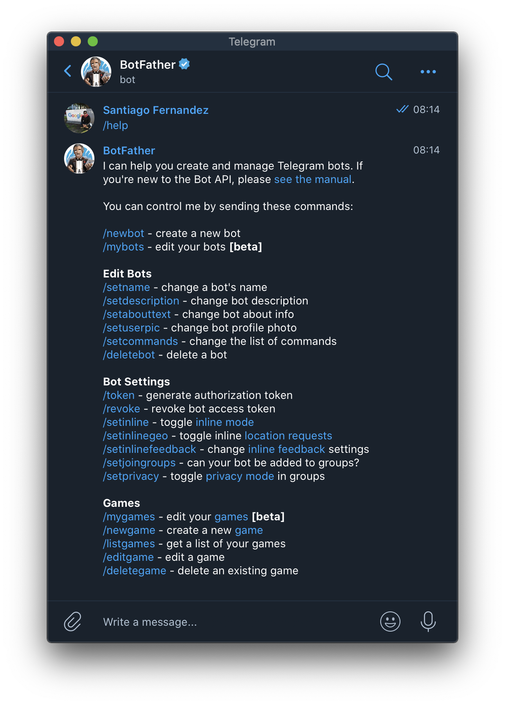
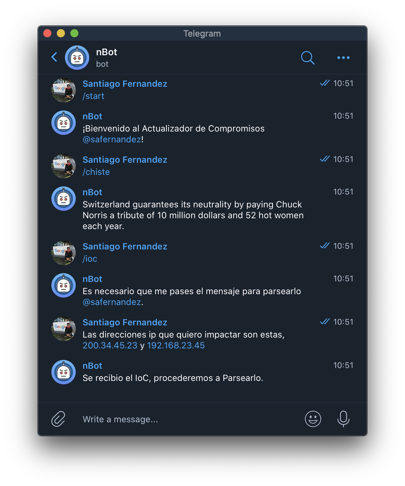
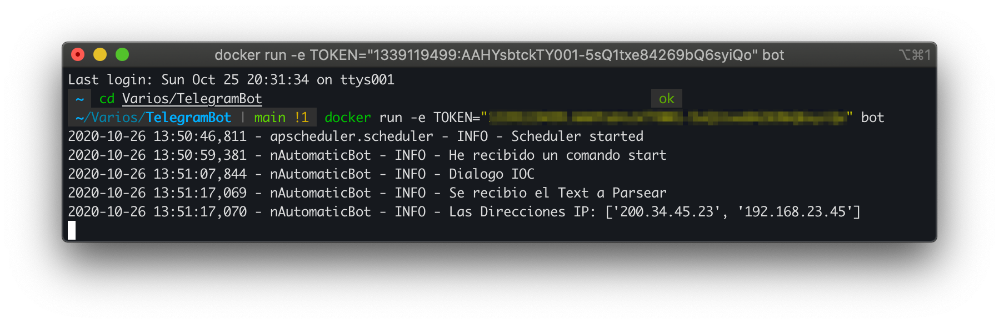
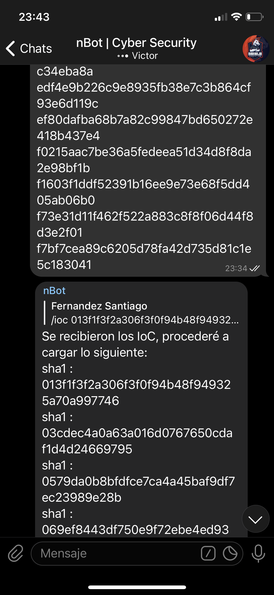
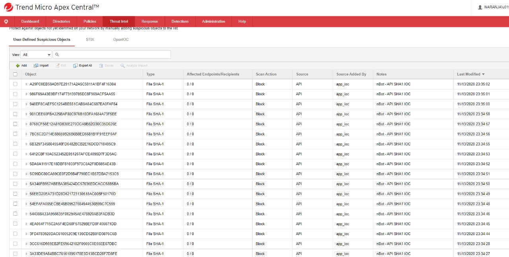

# Telegram IoC Bot

Add your IoC to your Antivirus Console & Firewall by a message.

### Create your bot with BotFather & generate your Token

[How To](https://core.telegram.org/bots)
<p align="center">

</p>

### Steps

#### Download the Proyect

```bash
git clone git@github.com:safernandez666/TelegramBot.git
```

#### Build the Image

```bash
docker build -t bot .
```

#### Run the Container

```bash
docker run -e TOKEN="YOUR_TOKEN" bot  
```

Dialogue between Bot and the Operator, where you are informed of directions to parse and impact the consoles.
<p align="center">

</p>
<p align="center">

</p>

#### Working

Depending on the integration you want to do, CrowdStrike, Trend Micro, Palo Alto, etc. you can develop the method in engine.py once the parsing is done.

Sending IoC to the Bot

<p align="center">

</p>

Impact on Apex One Trend Micro

<p align="center">

</p>
